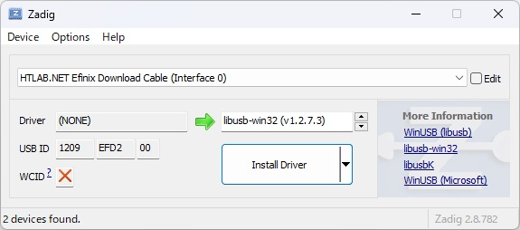

# How to install download cable driver in Windows

When you plug the created download cable into your computer for the first time, the driver will not be installed.

Install the driver as shown below.

## Install libusb-win32 driver using Zadig

If you check the device manager, you will see devices that do not have drivers installed.

1 device is displayed when using FT232H, 2 devices are displayed when using FT2232H, and 4 devices are displayed when using FT4232H.

Install the driver using [Zadig](https://zadig.akeo.ie/).

Select the target device from the list.

Select libusb-win32 and click the Install Driver button.

If there are multiple devices, apply the driver to all.

If there are no problems, it will be recognized by the Efinix Programmer.

Note!

The device will not be recognized unless the patch file has been applied to Efinity.

Please refer to the document in the Document folder and apply the patch to Efinity.

## How to uninstall the driver

Open Device Manager.

Specify your device and select uninstall.

Be sure to check Delete and then click the Uninstall button.

If there are multiple devices, uninstall them all.

When you connect the device again, the FTDI driver will be loaded.

If the FTDI driver does not load, you have had multiple drivers installed in the past.

Repeat the above operations until the FTDI driver is loaded.

Note!

Even if you use Zadig to change the driver to USB Serial (CDC), the old driver will not be uninstalled.

Also, since it is not an FTDI driver, it is not recognized by FT_PROG.

You must uninstall it from Device Manager.

