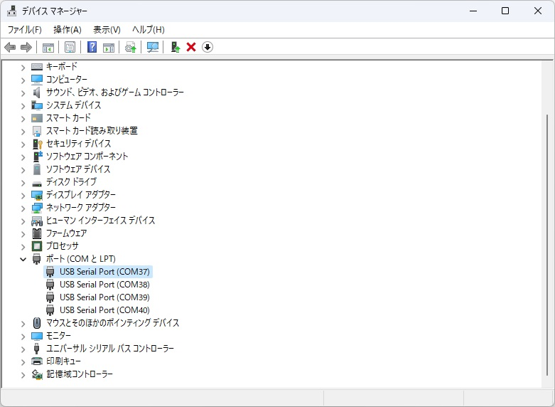
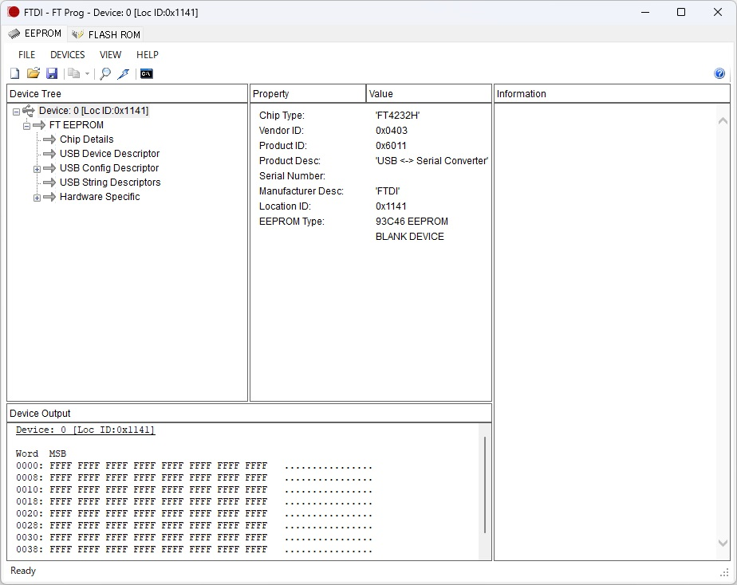
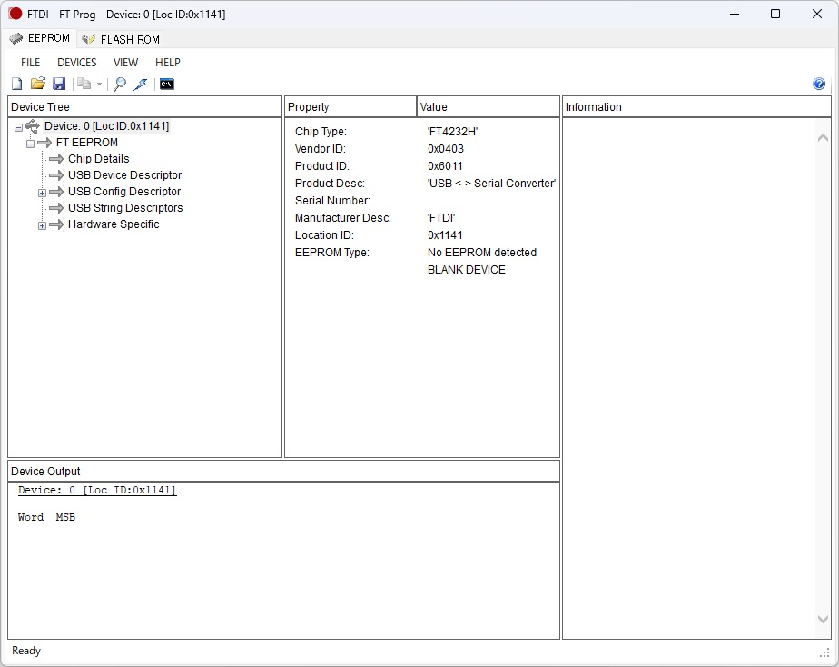
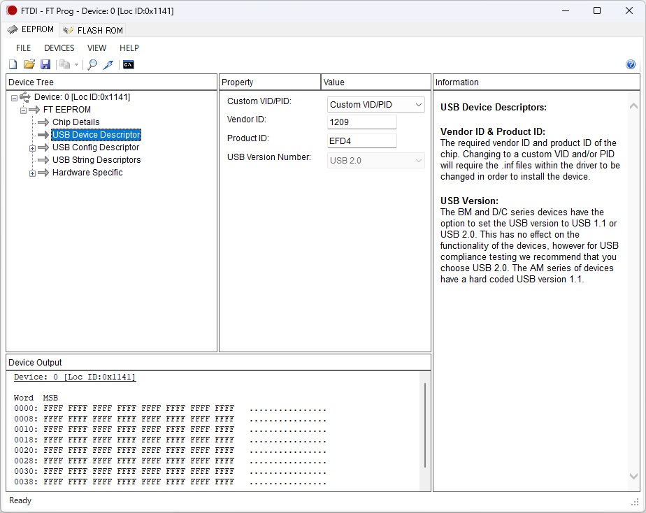
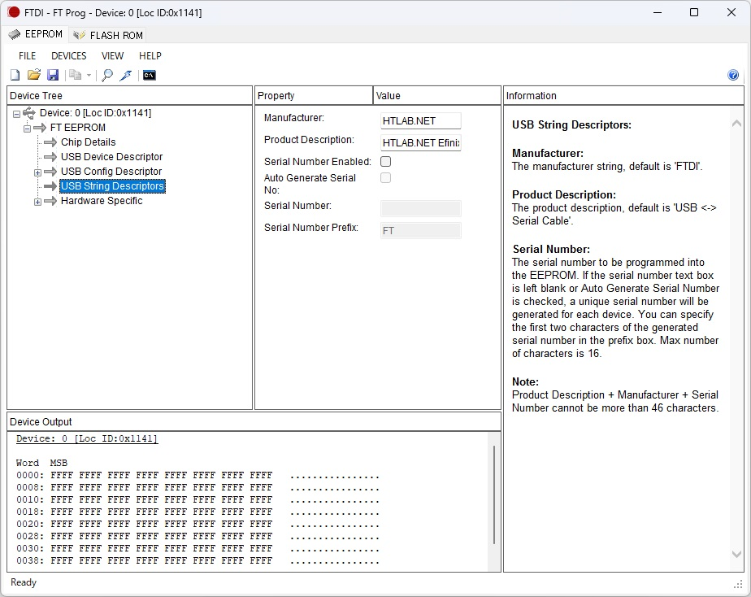
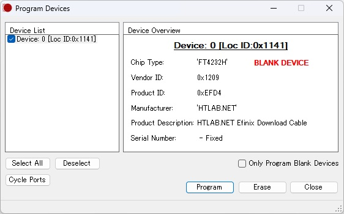
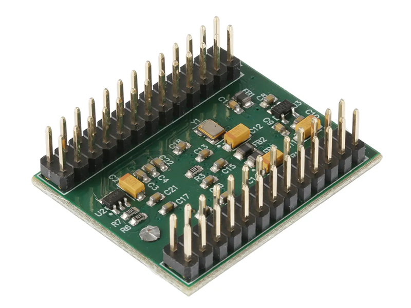
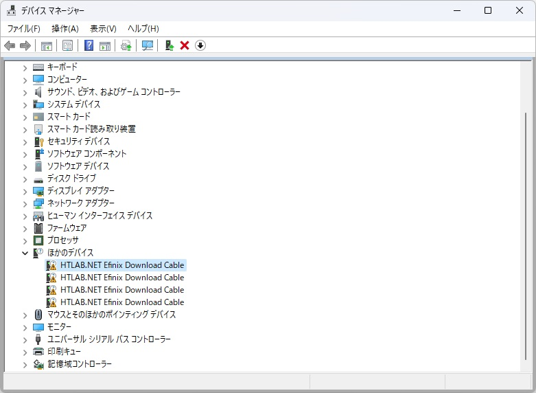

# HTLAB.NET Efinix Download Cable (FT4232H)

In addition to making your own board, you can also use a commercially available board equipped with FT4232H.

Please make sure that EEPROM is installed.

If EEPROM is not installed, please connect a compatible EEPROM (93C46, etc.).

## FT4232H Pin Assignment

| Pin | Name | FPGA |
|---|---|---|
| ADBUS0 | SPI_SCLK | CCK |
| ADBUS1 | SPI_MOSI | CDI0 |
| ADBUS2 | SPI_MISO | CDI1 |
| ADBUS3 | SPI_SS | SS_N |
| ADBUS4 | CRESET | CRESET_N |
| ADBUS5 | CDONE | CONDONE |
| ADBUS6 | HOLD | HOLD |
| BDBUS0 | TCK | TCK |
| BDBUS1 | TDI | TDI |
| BDBUS2 | TDO | TDO |
| BDBUS3 | TMS | TMS |

GND connection is required.

VDDIO must supply a voltage that matches the FPGA.

Note!

In the case of Trion FPGA, it is usually 3.3V, but when using Titanium FPGA, it may be 1.8V.

A level conversion circuit may be required.

## Change VID/PID Settings

[FT_PROG](https://ftdichip.com/utilities/) must be installed.

Start FT_PROG with the FTDI driver applied (COM port visible).

If the device is not recognized by FT_PROG, please try uninstalling the driver as it contains a driver other than FTDI (see the document in the Document folder).

If a VID/PID different from the default is written, it is necessary to disconnect the EEPROM.

When you disconnect the EEPROM and connect the FTDI device to your computer, it will boot with the default settings.

If you connect the EEPROM while it is HOT, you can rewrite it again.

The problem can also be resolved by disabling the driver signature and installing the FTDI driver against the written VID/PID.

However, this is not recommended as it will lower the security level of the Windows OS.

If EEPROM is not connected, it will be displayed on FT_PROG.

Please check the connection.

Open "USB Device Descriptor" and enter the following information.

| Property | Value |
|---|---|
| Custom VID/PID | Custom VID/PID |
| Vendor ID | 1209 |
| Product ID | EFD4 |

Never make a mistake with the Product ID for FT4232H.

The Product ID is different when using FT2232H or FT232H.

Please refer to the respective document.

Open "USB String Descriptors" and enter the following information.

| Property | Value |
|---|---|
| Manufacturer | HTLAB.NET |
| Product Description | HTLAB.NET Efinix Download Cable |
| Serial Number Enabled | False (Uncheck) |

Be sure to uncheck it.

Including the serial number may exceed 46 characters and cause the programmer software to crash.

Run the Program to write the settings to EEPROM.

Note!

By changing the VID/PID, it will no longer be recognized by FT_PROG.

Setting values incorrectly is dangerous.

Do NOT make a mistake with the Product ID for FT4232H.

You must double check to make sure.

If you write wrong setting values, you may need to disconnect the EEPROM to make it recognized by FT_PROG.

For reference, here is a photo of the EEPROM installed in the FT4232H Mini Module.

In the image, U2 (93LC56B) is an EEPROM, and if you write an incorrect value, you will need to remove it and erase it, or replace it with a blank chip.

This problem cannot be repaired unless you have soldering skills.

Unplug your device and plug it back in.

If a device to which no driver has been applied is recognized, the settings rewriting has been successful.

Please refer to the documentation in the Document folder for further instructions on how to use it and how to apply patches to Efinity.

