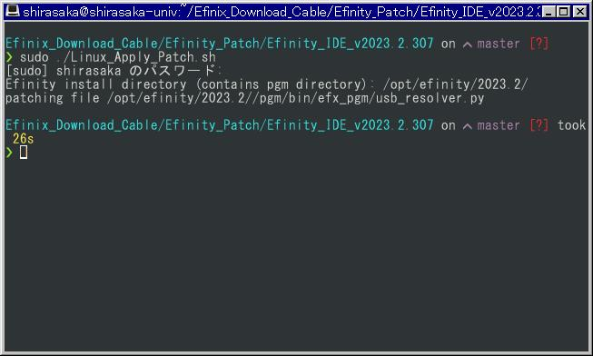

# How to use patch file in Linux

Make sure to close the Efinity app.

Run as root the "Linux_Apply_Patch.sh" file in the target version folder in the Efinity_Patch folder.

When prompted, specify the installation path of Efinity IDE

If programmer crashes after patching, try again after fully shutdown your computer (not reboot.)

