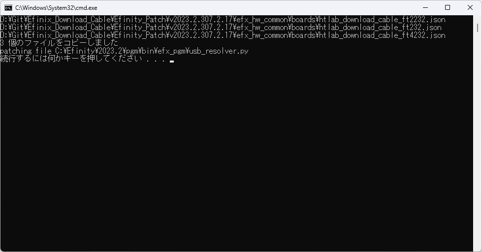

# How to use patch file in Windows

Software installation is required to apply the patch file.

[WinMerge](https://winmerge.org/) must be installed.

Make sure to close the Efinity app.

Run the "Windows_Apply_Patch_WinMerge.bat" file in the target version folder in the Efinity_Patch folder.

If the installation location of Efinity or WinMerge is different from the default, you will need to modify the path in the batch file.

