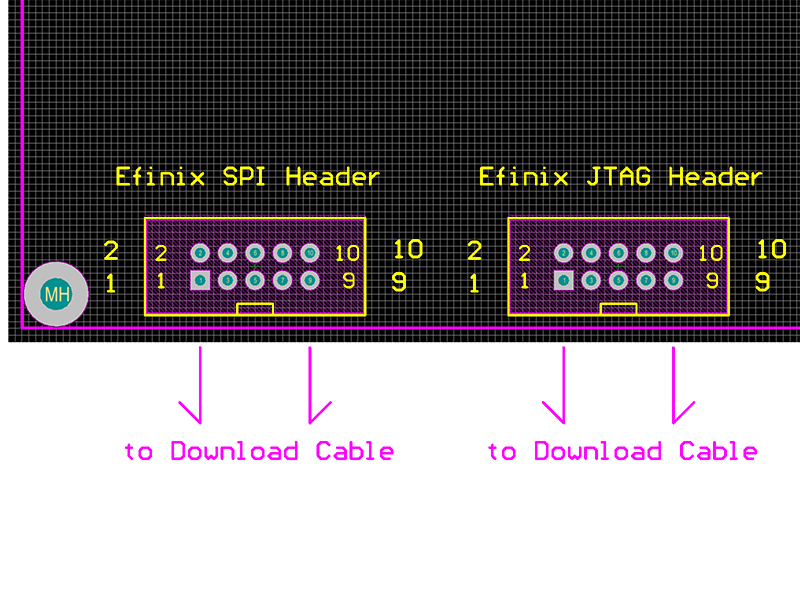
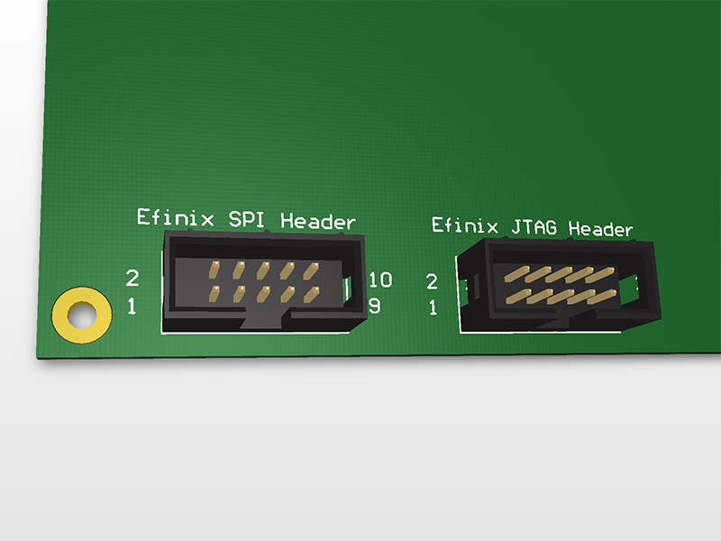
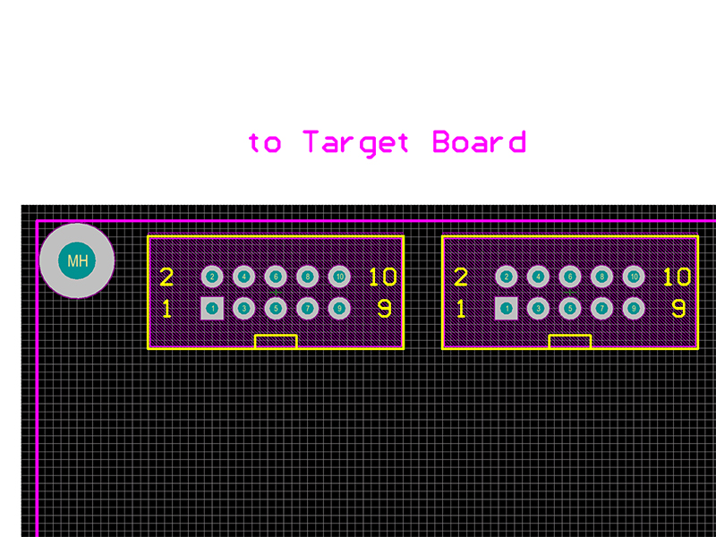
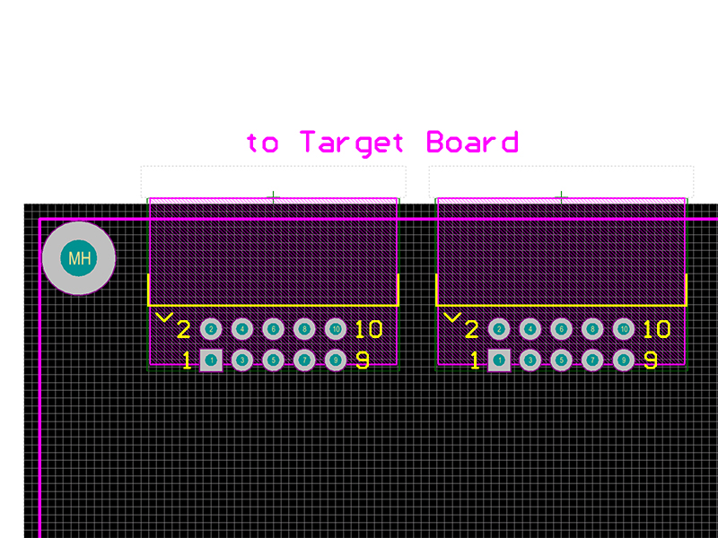
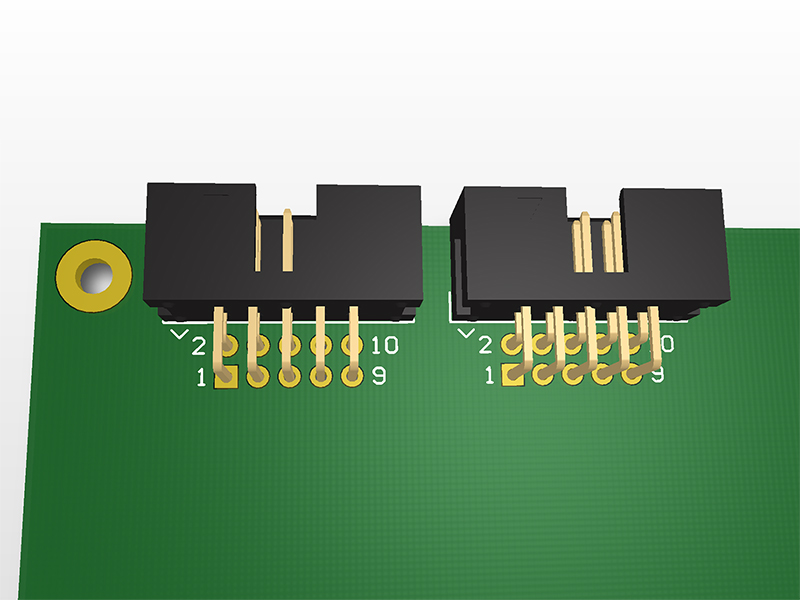
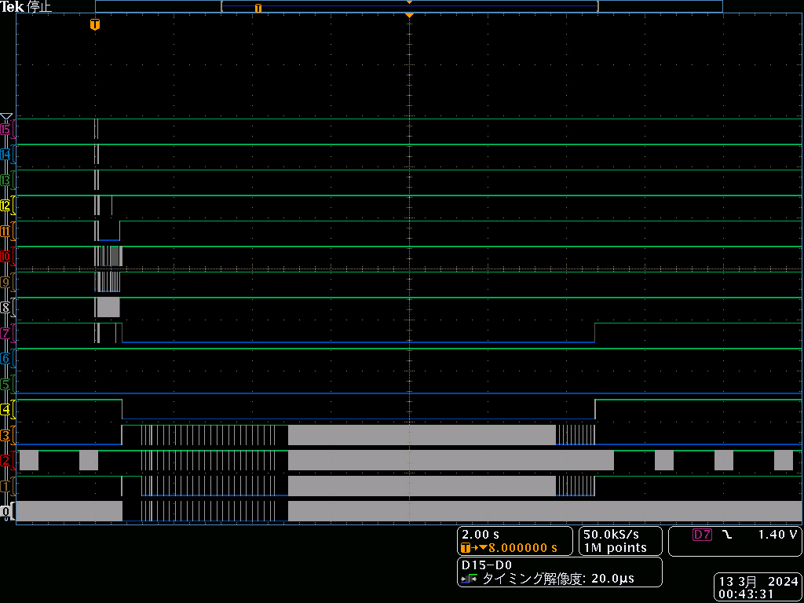
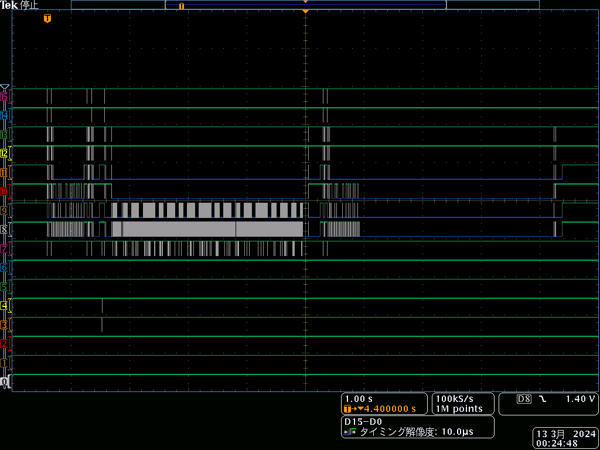

# Recommended SPI / JTAG Header Pin Assignment

When designing the Efinix FPGA board and programmer, I couldn't find any header pin assignment information, so I'll summarize it here.

Some of this information was inferred from the evaluation board's circuit diagram.

If you have any reliable information, I would appreciate it if you could let me know.

## SPI / JTAG Header Design on Target FPGA Board Side

Use a 2.54mm pitch 10 pin box header.

Either SPI header or JTAG header must be implemented.

In the case of the SPI header, it is connected in parallel with the flash, so it only supports writing.

JTAG headers can also be used for debugging, but they cannot be written directly to SPI flash and must be configured to pass through the design.

If there is space available on the board, it is recommended to install two headers.

### Recommended Header Design on Target FPGA Board Side (2D)

Due to the convenience of using a ribbon cable, it may be easier to use if the notch faces outward like Altera FPGA Board.

### Recommended Header Design on Target FPGA Board Side (3D)

The notch will face outward and the ribbon cable will extend outward.

### SPI Header Pin Assignment (Target FPGA Board Side)

"Input" here refers to the signal flowing from the programmer/download cable side to the FPGA on the target board.

| Pin | Name | I/O | Description |
|---|---|---|---|
|  1 | CCK | Input | SPI_SCLK. Clock input pin from the programmer side. |
|  2 | CRESET_N | Input | Reset input pin to perform reset. |
|  3 | CDI0 | Input | SPI_MOSI. Data input pin from programmer side. |
|  4 | CDONE | Output | Configuration completion signal output pin. |
|  5 | CDI1 | Output | SPI_MISO. Data output pin to programmer side. |
|  6 | HOLD | Input | HOLD. If use active quad (x4) mode, also connect to CDI3. |
|  7 | SS_N | Input | SPI_SS. Select input pin from programmer side. |
|  8 | VCCIO | Power | Basically, just connect it to 3.3V. |
|  9 | FTDI_RST | Input | If your board has an FTDI chip. If not, N.C. |
| 10 | GND | Power | GND. |

It seems that the VCCIO pin is there to inform the programmer side of the I/O voltage. (Maybe 1.8V to 3.3V)

If you look at the circuit diagram of the "Titanium Ti60 F225 Development Board", you can see that it performs level conversion.

The FTDI_RST pin seems to be used to disable the built-in programmer on the evaluation board.

Setting FTDI_RST to LOW puts the FTDI chip on the evaluation board in the reset state.

When the FTDI chip is in the reset state, the data pins are tri-stated (some pull-ups are enabled).

Therefore, writing operations from outside are not inhibited.

### JTAG Header Pin Assignment (Target FPGA Board Side)

"Input" here refers to the signal flowing from the programmer/download cable side to the FPGA on the target board.

| Pin | Name | I/O | Description |
|---|---|---|---|
|  1 | TDO | Output | JTAG communication line. |
|  2 | VCCIO | Power | Basically, just connect it to 3.3V. |
|  3 | TCK | Input | JTAG communication line. |
|  4 | TDI | Input | JTAG communication line. |
|  5 | TMS | Input | JTAG communication line. |
|  6 | FTDI_RST | Input | If your board has an FTDI chip. If not, N.C. |
|  7 | SS_N | Input | SPI_SS. Select input pin from programmer side. |
|  8 | CRESET_N | Input | Reset input pin to perform reset. |
|  9 | GND | Power | GND. |
| 10 | GND | Power | GND. |

T4 to T20 FPGAs require SS_N and CRESET_N pin control for mode control.

If you have FTDI chip on your board, you will need to wire FTDI_RST just like the SPI header.

## SPI / JTAG Header Design on Programmer / Download Cable Side

Use a 2.54mm pitch 10 pin box header.

Although it is possible to use one connector by switching, it is recommended to implement two connectors because the Input and Output may interfere.

VCCIO of FT2232H / FT4232H only supports 3.3V.

You will need a level conversion IC.

### Recommended Header Design on Programmer / Download Cable Side (2D / Vertical)

### Recommended Header Design on Programmer / Download Cable Side (2D / Horizontal)

### Recommended Header Design on Programmer / Download Cable Side (3D / Horizontal)

### SPI Header Pin Assignment (Programmer / Download Cable Side)

"Input" here refers to the signal flowing from the FPGA side on the target board to the programmer/download cable side.

| Pin | Name | I/O | Description |
|---|---|---|---|
|  1 | CCK | Output | SPI_SCLK. (Assigned to AD0 by default) |
|  2 | CRESET_N | Output | Reset. (Assigned to AD4 by default) |
|  3 | CDI0 | Output | SPI_MOSI. (Assigned to AD1 by default) |
|  4 | CDONE | Input | Configuration completion signal input. (Assigned to AD5 by default) |
|  5 | CDI1 | Input | SPI_MISO. (Assigned to AD2 by default) |
|  6 | HOLD | Output | Hold. (Assigned to AD6 by default) |
|  7 | SS_N | Output | SPI_SS. (Assigned to AD3 by default) |
|  8 | VCCIO | Power | Level conversion is required to match this voltage. (Maybe 1.8V to 3.3V) |
|  9 | FTDI_RST | Output | Must be connected to GND to put FTDI on the target board into the reset state. |
| 10 | GND | Power | GND. |

AD7 is the SPI bus enable pin.

The LOW state allows communication, and the HIGH state requires high impedance for communication with the SPI flash.

### JTAG Header Pin Assignment (Programmer / Download Cable Side)

"Input" here refers to the signal flowing from the FPGA side on the target board to the programmer/download cable side.

| Pin | Name | I/O | Description |
|---|---|---|---|
|  1 | TDO | Input | JTAG communication line. (Assigned to BD2 by default) |
|  2 | VCCIO | Power | Level conversion is required to match this voltage. (Maybe 1.8V to 3.3V) |
|  3 | TCK | Output | JTAG communication line. (Assigned to BD0 by default) |
|  4 | TDI | Output | JTAG communication line. (Assigned to BD1 by default) |
|  5 | TMS | Output | JTAG communication line. (Assigned to BD3 by default) |
|  6 | FTDI_RST | Output | Must be connected to GND to put FTDI on the target board into the reset state. |
|  7 | SS_N | Output | SPI_SS. It is safe to use open collector output to avoid interference with the SPI header. |
|  8 | CRESET_N | Output | Reset. It is safe to use open collector output to avoid interference with the SPI header. |
|  9 | GND | Power | GND. |
| 10 | GND | Power | GND. |

## Waveform during programming

For reference, the waveform during programming.

Ch0 is AD0, Ch1 is AD1, Ch8 is BD0 and Ch15 is BD7.

Since the FTDI and FPGA are directly connected without level conversion, you can see that the flash is being read immediately during SPI.

### SPI Active

### JTAG

