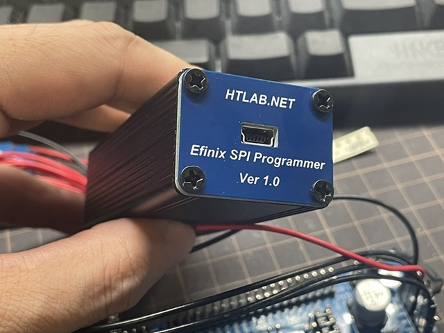

# HTLAB.NET Efinix Download Cable

This repository is intended to create cables for programming Efinix FPGAs for which no official download cables exist.

Efinix recommends using FTDI's USB serial IC to create a download cable.

However, since FTDI's default USB VID/PID is used and the driver is replaced, other FTDI devices will become inoperable.

To solve this problem, I will provide a download cable creation method and a corresponding patch for the FPGA programmer software.

This website is in Japanese, but more information can be found here.

https://htlab.net/electronics/pld/efinix/efinix-download-cable/

## How to create a download cable

Browse to the Hardware folder within the repository.

| IC | VID | PID | SPI Mode | JTAG Mode |
|---|---|---|---|---|
| FT232H | 0x1209 | 0xEFD1 | Support | - |
| FT2232H | 0x1209 | 0xEFD2 | Support | Support |
| FT4232H | 0x1209 | 0xEFD4 | Support | Support |

I recommend using FT2232H to create a download cable.

## How to use the download cable

Browse to the Document folder within the repository.

## How to use patch file

Browse to the Document folder within the repository.

The patch files are located in the Efinity_Patch folder of this repository.

The download cable will not be recognized unless the patch file is applied.

## Licence

Software is licensed under MIT license.

However, Efinity Programmer to which the patch is applied is licensed to Efinix Inc.
